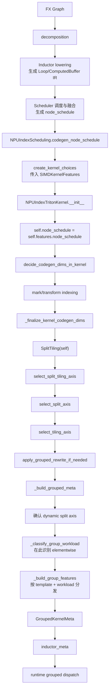
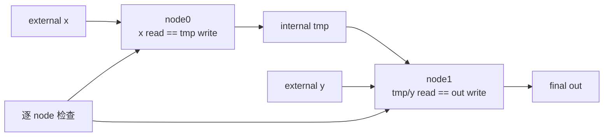
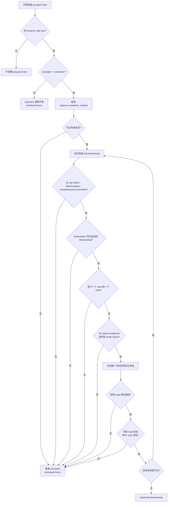

# Symbolic Grouped Autotune 增加 Elementwise Workload 设计

## 1. 结论

在现有 `pointwise` template 下增加 `group_workload=elementwise`，不要新增 Triton
heuristic/template 类型，也不要修改上游 PyTorch 的 decomposition、lowering 或 pointwise
算子注册方式。

elementwise 的识别放在 NPU `SplitTiling` 阶段，仅在以下条件同时满足时执行：

```text
grouped symbolic autotune 已开启
    AND template 已被配置允许
    AND kernel 存在动态 split axis
    AND template == pointwise
```

本设计中的 elementwise 不是“算子名称属于数学逐元素集合”，而是更贴近 device 执行特征的
“直接一一映射 pointwise”：每个输出 lane 独立计算，并且每个张量读、写都使用相同的直接
迭代映射。broadcast、reindex、间接索引、语义 mask、scatter/atomic store 和纯数据生成不准入。

识别不使用算子 allowlist 或 blacklist。它直接复用 Scheduler 已经从 `LoopBody` 提取出的
`SchedulerNode.read_writes`，对融合 kernel 中的每个 SchedulerNode 分别比较 `MemoryDep` 的
规范化访问签名。无法证明是 elementwise 时返回 `None`，继续使用原 pointwise group 策略。

这样做有三个直接结果：

1. 不向上游 CUDA PyTorch 增加 NPU 专用语义或维护大量算子名单；
2. broadcast 即使没有独立 DSL op，也会通过 read/write 索引映射不一致被排除；
3. cast、clone、copy、同 shape 的 `where` 等只要访存是一一映射，就可以共用 elementwise
   group 策略。

## 2. 问题背景

### 2.1 当前分类粒度

当前 NPU Triton kernel 的整体 heuristic/template 主要分为：

| kernel 状态 | heuristic/template |
| --- | --- |
| persistent reduction | `persistent_reduction` |
| reduction | `reduction` |
| 其他无 reduction kernel | `pointwise` |

因此 `pointwise` 实际覆盖多种 device 行为：

- 同 shape 的逐元素算术或逻辑计算；
- broadcast 后的逐元素计算；
- transpose、slice、repeat、pad 等带 reindex 的计算；
- gather/index_select 等间接寻址；
- scatter、atomic 等特殊写入；
- full、iota、random 等没有普通张量输入的数据生成。

这些 kernel 都没有 reduction 轴，但访存模式、有效数据量和并行 block 的收益可能不同。
如果 grouped symbolic autotune 只使用统一的 pointwise bucket，无法为访问模式相近的直接
elementwise kernel 单独调整 group 策略。

### 2.2 为什么不新增 elementwise template

`pointwise/reduction/persistent_reduction` 描述 kernel 的整体迭代和 codegen 结构，
elementwise 只是在 pointwise 内按 device 行为继续细分。把 elementwise 提升为新的 template
会扩大以下接口的修改范围：

- heuristic/decorator 选择；
- template 配置 allowlist；
- runtime launcher 和 cache key；
- 上游 PyTorch 与 NPU 分支的分类契约。

这些改动并不是独立 group 策略所必需的。因此采用两层分类：

```text
group_template
├── pointwise
│   ├── group_workload = elementwise
│   └── group_workload = None
├── reduction
└── persistent_reduction
```

`group_workload=None` 表示普通 pointwise、识别不确定或暂未细分的 pointwise。当前不再细分
broadcast、reindex、generation 等其他 workload。

## 3. 设计目标与边界

### 3.1 目标

1. 在现有 pointwise template 内增加 elementwise workload。
2. 给 elementwise 提供独立的 group feature/bucket 分发入口。
3. 给出可落地到 `SplitTiling` 的字段来源、调用链和判定算法。
4. 支持融合 kernel，不依赖原始 FX op 名称。
5. 只影响开启 group 特性后的动态 shape kernel。
6. 对不确定场景保守回退，不能因为分类失败中断 codegen。
7. 保持旧 payload、静态 shape、reduction 和 group 关闭场景兼容。

### 3.2 非目标

1. 不新增 `elementwise` Triton heuristic、decorator 或 template。
2. 不修改上游 `register_pointwise()`、`make_pointwise()`、decomposition 或 lowering。
3. 不维护 Python API/ATen op 的完整 allowlist 或 blacklist。
4. 不在本需求中继续细分非 elementwise pointwise。
5. 不在没有 profiling 数据时预设最终 elementwise bucket。
6. 不增加额外 DFX 能力；现有 metadata 足够验证分类结果。

## 4. Elementwise 的工程定义

### 4.1 选择“直接一一映射”，不选择“狭义数学 elementwise”

目标是把 device 上表现相近、可以共用同一份 group 策略的 kernel 放在一起。因此分类应关注
迭代 lane 与访存地址的关系，而不是 API 的数学类别。

本设计定义：一个 pointwise 融合 kernel 是 elementwise，当且仅当它的每个 SchedulerNode
都满足以下条件：

1. 每个输出 lane 独立，不包含 reduction 或跨 lane 数据依赖；
2. 至少有一个普通张量 read 和一个普通 tensor write；
3. 所有 tensor write 使用同一个直接迭代映射；
4. 所有 tensor read 与该 write 使用相同的直接迭代映射；
5. 不存在跨 lane primitive、间接索引、语义 masked 子块、特殊 store mode、alias/mutation
   或未知依赖类型。

逻辑形式为：

```text
out[address(i)] = f(in0[address(i)], in1[address(i)], ..., scalar_constants)
```

这里比较的是去除固定 storage offset 后的 `address(i)`。固定 offset 不改变 lane 间的映射，
例如 `x[4:] + 1` 仍可视为直接一一映射；但 `x[::2] + 1` 的 stride 发生变化，不准入。

### 4.2 典型分类结果

| 场景 | 分类 | 原因 |
| --- | --- | --- |
| `relu(x)` | elementwise | read/write 映射一致 |
| 同 shape `x + y` | elementwise | 两个 read 都与 write 映射一致 |
| 同 shape `where(mask, x, y)` | elementwise | `where` 是逐 lane 值选择，不是 masked 子块 |
| dtype cast | elementwise | dtype 改变不改变 lane 到地址的映射 |
| clone/copy | elementwise | 只要源和目标采用相同直接映射 |
| `x[4:] + 1` | elementwise | 固定 base offset 去除后映射一致 |
| broadcast add | 普通 pointwise | broadcast read 缺失迭代轴/表现为零 stride |
| transpose 后计算 | 普通 pointwise | read 和 write 的 stride/轴顺序不同 |
| `x[::2]` | 普通 pointwise | read stride 与 write stride 不同 |
| gather/index_select | 普通 pointwise | read index 包含 indirect/tmp symbol |
| repeat/pad/cat | 普通 pointwise | reindex 或语义 mask 导致结构不一致 |
| scatter/atomic | 普通 pointwise | 写映射或 store mode 不满足普通写入 |
| full/iota/random | 普通 pointwise | 没有与 write 对齐的普通张量 read |

### 4.3 为什么 broadcast 不属于本分类

以动态 broadcast 为例：

```python
def fn(x, y):
    # x: [M, N], y: [N]
    return x + y
```

概念上的生成 DSL 为：

```python
pid_m = tl.program_id(0)
pid_n = tl.program_id(1)
m = pid_m * M_BLOCK + tl.arange(0, M_BLOCK)
n = pid_n * N_BLOCK + tl.arange(0, N_BLOCK)

x_value = tl.load(x_ptr + m[:, None] * N + n[None, :], mask=...)
y_value = tl.load(y_ptr + n[None, :], mask=...)
tl.store(out_ptr + m[:, None] * N + n[None, :], x_value + y_value, mask=...)
```

通常不会生成一个独立的 `broadcast` 计算 op。broadcast 已经由 lowering 中的 view/reindex
关系折叠进 load 地址：

```text
x read:   d0 * N + d1, ranges=(M, N)
y read:   d1,          ranges=(N)       # 不依赖 d0
out write:d0 * N + d1, ranges=(M, N)
```

`y` 的访问签名与 output write 不同，因此结构判定自然排除 broadcast。DSL 中为越界保护生成的
tail mask 不属于源程序的语义 masked 子块，不影响分类。

## 5. 为什么不采用算子白名单或黑名单

### 5.1 白名单的问题

白名单需要枚举所有可以生成目标访存行为的入口，但 elementwise 的来源不只是一组固定 API：

- 同一个 ATen op 可因 shape/layout 不同产生直接映射或 broadcast/reindex；
- decomposition 会把复合 op 展开为多组 primitive；
- fusion 后一个 kernel 同时包含多个 SchedulerNode；
- 新算子、dtype overload 和 decomposition 调整会持续扩大名单；
- `torch.Tag.pointwise` 只能说明没有 reduction，不能区分 broadcast。

例如 `aten.add.Tensor` 既可能是同 shape add，也可能是 broadcast add。仅看 op 名称无法完成
本需求的区分。

### 5.2 黑名单的问题

黑名单默认把未知场景当 elementwise，容易产生 false positive。需要排除的不仅有 broadcast，
还有 reindex、indirect indexing、masked access、特殊 store 等结构，而且后续新增 lowering
primitive 可能绕过已有名单。

### 5.3 采用结构正向准入

结构准入只接受能够由当前 IR 证明为直接一一映射的 kernel：

```text
可以证明 read/write 映射一致 -> elementwise
不能证明或发现特殊结构       -> 普通 pointwise
```

分类只影响性能策略，不影响正确性。保守策略允许 false negative，但应尽量避免 false positive。
这也使规则规模由“所有算子数”收敛为少量稳定的 IR 结构条件。

## 6. 分类阶段与完整调用链

### 6.1 阶段位置

decomposition 和 lowering 都发生在 Scheduler/SplitTiling 之前。SplitTiling 拿到的是 lowering
后的调度节点及其真实内存访问，而不是原始用户 op。

选择 SplitTiling 的原因：

- 已完成 lowering，可以看到 broadcast/reindex 的实际索引；
- 已完成 scheduler fusion，可以判定最终 kernel 内的所有计算节点；
- 尚未生成最终 DSL，分类结果可以参与 grouped feature 构造；
- group 开关、template allowlist 和动态 split axis 已在此处收敛，避免影响通用路径。

### 6.2 当前调用链



对应代码证据：

| 调用/数据 | 代码位置 |
| --- | --- |
| 调度入口取得 `kernel_features.node_schedule` | `pytorch_new/torch_npu/_inductor/codegen/scheduling.py:146` |
| `create_kernel_choices(..., features=kernel_features)` | `pytorch_new/torch_npu/_inductor/codegen/scheduling.py:152` |
| kernel 保存 `self.features.node_schedule` | `pytorch_new/torch_npu/_inductor/codegen/triton.py:1412` |
| kernel 初始化时进入维度决策 | `pytorch_new/torch_npu/_inductor/codegen/triton.py:1421` |
| 维度决策完成后创建 `SplitTiling` | `pytorch_new/torch_npu/_inductor/codegen/triton.py:1607` |
| split/tiling 后进入 grouped rewrite | `pytorch_new/torch_npu/_inductor/codegen/split_tiling.py:234` |
| 动态 split axis 检查和 meta 构造 | `pytorch_new/torch_npu/_inductor/codegen/split_tiling.py:311` |

行号用于定位当前实现，代码演进后应以函数名为准。

## 7. SplitTiling 能拿到什么数据

### 7.1 `SIMDKernelFeatures.scheduler_nodes()`

`SIMDKernelFeatures` 表示将生成单个 kernel 的有序 schedule，并提供：

```python
def scheduler_nodes(self) -> Iterable[SchedulerNode]:
    return tuple(NodeScheduleMarker.only_nodes(self.node_schedule))
```

它会过滤 `EnableReduction`、`DisableReduction` 这类 schedule marker，只返回实际计算节点。
代码位于 `pytorch/torch/_inductor/codegen/simd_kernel_features.py:75`。

在 SplitTiling 中可直接取得：

```python
nodes = tuple(self.kernel.features.scheduler_nodes())
```

### 7.2 `SchedulerNode.read_writes`

`SchedulerNode._compute_attrs()` 在构建调度节点时调用：

```python
dependencies.extract_read_writes(
    self._body,
    *self._sizes,
    normalize=should_normalize,
)
```

因此每个节点已经具有：

```text
node.read_writes.reads   # OrderedSet[Dep]
node.read_writes.writes  # OrderedSet[Dep]
node._body               # LoopBody，可查询 op/内存语义
```

代码证据位于 `pytorch/torch/_inductor/scheduler.py:1446`。依赖是从已经 lowering 的
`LoopBody` 中提取，不要求重新 trace FX graph。

### 7.3 `MemoryDep` 字段

普通内存访问使用 `MemoryDep` 表示：

```python
@dataclasses.dataclass(frozen=True)
class MemoryDep(Dep):
    name: str
    index: sympy.Expr
    var_names: tuple[sympy.Symbol, ...]
    size: tuple[sympy.Expr, ...]
    mode: str | None = None
```

字段语义：

| 字段 | 含义 | 分类用途 |
| --- | --- | --- |
| `name` | 访问的 buffer 名称 | 仅定位访问，不参与映射相等判断 |
| `index` | 由迭代变量计算出的线性地址表达式 | 判断 broadcast、stride、reindex |
| `var_names` | 此访问保留的迭代变量 | 判断是否缺失 broadcast 轴 |
| `size` | 每个迭代变量的范围 | 判断两次访问的迭代域是否一致 |
| `mode` | store 的特殊模式 | 排除 atomic 等特殊写入 |

`MemoryDep` 还提供：

- `is_indirect()`：检查 index 是否包含 indirect/tmp symbol；
- `normalize()`：在不重排 loop 的前提下合并可合并维度；
- `get_offset()`：把迭代变量置零，取得固定 base offset。

定义位于 `pytorch/torch/_inductor/dependencies.py:76`。现有 Scheduler 的 inplace 判定也使用
`read_dep.index == write_dep.index and read_dep.size == write_dep.size` 证明访问一一对应，见
`pytorch/torch/_inductor/scheduler.py:1740`，说明使用 MemoryDep 比较访问映射符合现有模型。

### 7.4 为什么不收集“外部 reads 和最终 writes”

融合 kernel 可能有内部临时 buffer：

```text
node0: tmp = relu(x)
node1: out = tmp * y
```

如果先把整个 kernel 的 ReadWrites 合并，再试图区分外部输入和最终输出，需要额外处理：

- 被融合消除的内部 buffer；
- mutation rename、alias 和 inplace；
- 多输出和中间结果仍被外部使用；
- `ReadWrites.merge_list()` 会从 reads 中移除同时被 writes 覆盖的名字，但保留所有 writes。

这会把 elementwise 分类变成一次新的 kernel 边界分析。实际上没有必要：逐 SchedulerNode
检查即可。如果 node0 的 `x read -> tmp write` 和 node1 的 `tmp/y read -> out write` 都是一一
映射，整个融合 kernel 就满足要求；任一节点包含 broadcast/reindex，整个 kernel 回退。



内部 buffer 在 producer 中作为 write、在 consumer 中作为 read，映射会在两个节点各自得到
验证，不需要显式判断它是否为 external/final。

## 8. 详细识别算法

### 8.1 三层门禁

识别分为 kernel 前置门禁、逐节点结构门禁和访问签名门禁。



### 8.2 Kernel 前置门禁

`_classify_group_workload()` 只在 `_build_grouped_meta()` 确认有动态 split axis 后调用：

```python
def _build_grouped_meta(self):
    dynamic_split_axes, static_split_axes = self._classify_split_axes()
    if not dynamic_split_axes:
        return None

    template = self._grouped_template_name()
    workload = self._classify_group_workload(template)
    # 后续选择 primary axis、features 并构造 meta
```

分类入口：

```python
def _classify_group_workload(self, template: str) -> str | None:
    if template != "pointwise":
        return None

    nodes = tuple(self.kernel.features.scheduler_nodes())
    if not nodes:
        return None

    if all(self._is_direct_elementwise_node(node) for node in nodes):
        return "elementwise"
    return None
```

不要在 group 开关关闭、template 不在 allowlist 或没有动态 split axis 时执行扫描，避免给现有
codegen 增加无效开销。

### 8.3 逐节点结构门禁

每个 SchedulerNode 先执行以下检查：

1. `node.has_side_effects()` 必须为 false；
2. `node.has_aliasing_or_mutation()` 必须为 false；
3. `node._body` 不能包含 `masked`、`scan` 或 `sort`；
4. reads 和 writes 中的依赖必须全部是可比较的 `MemoryDep`；
5. 至少有一个 read 和一个 write；
6. 每个 read/write 都必须满足 `is_indirect() == false`；
7. 每个 write 的 `mode` 必须为 `None`。

这些条件是 IR 结构条件，不是 ATen/Python 算子 blacklist：

- `masked` 指 `ops.masked()` 产生的语义子块，例如 pad/cat 可能产生的条件内存访问；
- `scan`、`sort` 即使 read/write index 相同，也存在 MemoryDep 无法表示的跨 lane 依赖；
- 正常 Triton tile 越界 mask 是后续 codegen 自动生成的，不存在于 LoopBody 的语义 op 中；
- `torch.where` lowering 为逐元素值选择，不等于 `ops.masked()`，不会因此被排除；
- `StarDep` 表示依赖整个 buffer，`WeakDep` 表示排序/变异依赖，它们都没有可比较的 index；
- 遇到未知 Dep 类型直接回退，避免把无法证明的访问当作一一映射。

第一版保守排除 alias/mutation。它们未必全部具有不同 device 行为，但依赖命名和写入语义更
复杂；后续只有在性能数据证明有价值，并能建立独立结构证明时才放宽。

### 8.4 访问签名

不能直接比较原始 `MemoryDep.index`，因为等价访问可能存在：

- 不同的局部迭代变量名称；
- 可合并但尚未合并的迭代轴；
- 不影响 lane 映射的固定 storage offset；
- 可被 sizevars 化简的符号表达式差异。

定义访问签名：

```text
AccessSignature = (
    normalized_index_without_constant_offset,
    normalized_iteration_sizes,
)
```

生成步骤：

1. 调用 `dep.normalize()`，合并可合并 loop，但不按 stride 重排 loop；
2. 将 normalize 后的 `var_names` 按位置 alpha-rename 为统一局部符号；
3. 计算并去除 `get_offset()`；
4. 使用 `V.graph.sizevars.simplify()` 化简 index 和 size；
5. 保存“化简 index + size tuple”作为签名。

概念伪代码：

```python
@dataclasses.dataclass(frozen=True)
class _AccessSignature:
    index: sympy.Expr
    sizes: tuple[sympy.Expr, ...]


def _make_access_signature(dep: MemoryDep) -> _AccessSignature | None:
    if dep.is_indirect() or dep.mode is not None:
        return None

    normalized = dep.normalize()
    replacements = _alpha_rename_by_position(normalized.var_names)
    index = sympy_subs(
        normalized.index - normalized.get_offset(),
        replacements,
    )
    sizes = tuple(
        sympy_subs(size, replacements) for size in normalized.size
    )
    return _AccessSignature(
        index=V.graph.sizevars.simplify(index),
        sizes=tuple(V.graph.sizevars.simplify(size) for size in sizes),
    )
```

`_alpha_rename_by_position()` 只统一局部迭代变量名，不替换 shape symbol。动态 shape symbol 必须
保留，才能区分不同 symbolic stride/size。

签名相等应优先使用结构相等；若表达式结构不同，再使用现有 sizevars 的静态相等能力验证。
只有能证明相等时返回 true，化简异常或无法证明均返回 false。

### 8.5 节点判定

概念实现：

```python
def _is_direct_elementwise_node(self, node: SchedulerNode) -> bool:
    if node.has_side_effects() or node.has_aliasing_or_mutation():
        return False
    if any(node._body.has_op(op) for op in ("masked", "scan", "sort")):
        return False

    reads = tuple(node.read_writes.reads)
    writes = tuple(node.read_writes.writes)
    if not reads or not writes:
        return False
    if not all(isinstance(dep, MemoryDep) for dep in (*reads, *writes)):
        return False

    read_signatures = tuple(self._make_access_signature(dep) for dep in reads)
    write_signatures = tuple(self._make_access_signature(dep) for dep in writes)
    if any(signature is None for signature in (*read_signatures, *write_signatures)):
        return False

    reference = write_signatures[0]
    if not all(self._same_access_signature(reference, sig) for sig in write_signatures):
        return False
    return all(self._same_access_signature(reference, sig) for sig in read_signatures)
```

这里“至少一个 read”用于把 full/iota/random 等生成类 kernel 保留在普通 pointwise。标量常量
不会形成 MemoryDep，可以参与 `f(...)`；0 维 tensor load 会形成固定地址 read，其签名不会与
逐元素 write 相等，因此按 broadcast 处理。

### 8.6 异常与保守回退

分类函数不应吞掉任意 `Exception`。实现时只捕获规范化过程中已知的符号分析异常，并返回
`None`/false；编程错误仍应在测试阶段暴露。准则如下：

```text
已知“无法证明相等” -> 回退普通 pointwise
不支持的 Dep/语义  -> 回退普通 pointwise
分类代码自身的 bug  -> 不使用宽泛 except 隐藏
```

## 9. 关键场景如何判定

### 9.1 同 shape 融合链

```python
tmp = relu(x)
out = tmp * y
```

可能得到：

```text
node0 reads : x   index=d0*N+d1, size=(M,N)
node0 writes: tmp index=d0*N+d1, size=(M,N)

node1 reads : tmp index=d0*N+d1, size=(M,N)
              y   index=d0*N+d1, size=(M,N)
node1 writes: out index=d0*N+d1, size=(M,N)
```

两个节点分别通过，kernel 为 elementwise。

### 9.2 融合链中包含 broadcast

```python
tmp = relu(x)       # x: [M, N]
out = tmp + y       # y: [N]
```

node0 通过；node1 的 `y read` 只依赖 `d1`，与 output write 签名不同。只要一个节点失败，整个
融合 kernel 回退普通 pointwise。

### 9.3 固定 offset 与步长 slice

```text
x[4:]  read index = d0 + 4
out    write index = d0
```

去除固定 offset 后均为 `d0`，可准入。

```text
x[::2] read index = 2*d0
out    write index = d0
```

去除 offset 后仍不同，不准入。

### 9.4 多输入、多输出

- 多输入：每个 read 都必须与统一 write 签名相同；任一 broadcast/reindex input 即失败。
- 多输出：所有 write 必须具有同一签名；不同 layout 或不同迭代域即失败。
- 一个输出 direct、另一个输出特殊 store：整个 node 失败。

这保证同一 kernel 只使用一种可解释的直接映射。

### 9.5 间接索引

gather/index_select 的 load index 会包含由其他 load 计算出的 `indirect`/`tmp` symbol。
`MemoryDep.is_indirect()` 已按这些符号检测，直接回退，不需要列举 gather API。

### 9.6 `where` 与语义 mask

```python
out = torch.where(mask, x, y)
```

同 shape 时，mask/x/y 都按 output index load，值选择是 lane 内计算，可以准入。

`ops.masked(mask, body, other)` 则表示只在条件子块中执行某些 load/计算。它在 LoopBody 中表现
为额外 subblock，访问代价与普通逐 lane load 不同，第一版保守排除。

## 10. 元数据与接口设计

### 10.1 `GroupedKernelMeta`

增加可选字段：

```python
@dataclasses.dataclass(frozen=True, slots=True)
class GroupedKernelMeta:
    enabled: bool
    template: str
    workload: str | None
    primary_group_axis: str | None
    static_split_axes: tuple[str, ...]
    secondary_runtime_symbolic_axes: tuple[str, ...]
    group_features: tuple[GroupFeatureSpec, ...]
    runtime_block_arg_names: tuple[str, ...]
```

命名采用 `workload`，写入 `inductor_meta` 时使用：

```python
{
    "group_template": "pointwise",
    "group_workload": "elementwise",
}
```

reduction、普通 pointwise 和识别失败场景使用 `None`。

### 10.2 Payload 兼容

`to_payload()` 写出 `workload`；`from_payload()` 对缺失字段使用 `None`：

```python
workload=_require_optional_str(payload.get("workload"), "workload")
```

因为 `Mapping.get()` 对旧 payload 返回 `None`，现有序列化结果仍可读取。若 workload 未来加入
更多取值，应增加显式枚举校验；当前只允许 `None` 和 `"elementwise"`。

### 10.3 `inductor_meta`

存在 grouped meta 时增加：

```python
"group_workload": grouped_meta.workload
```

没有 grouped meta 或 `_disable_grouped_autotune()` 时清理为：

```python
"group_workload": None
```

必须同步修改正常构造和 disable 清理路径，避免 fallback 后残留 elementwise 标识。

## 11. Group Feature 分发

将接口从：

```python
_build_group_features(primary_axis)
```

调整为：

```python
_build_group_features(template, workload, primary_axis)
```

### 11.1 Reduction

保持现有逻辑：

```text
outer feature:     非 reduction axis product，bucket=(256,)
reduction feature: reduction axis product，bucket=(8192,)
```

### 11.2 普通 Pointwise

保持现有 feature 和 bucket：

```python
GroupFeatureSpec(
    name="pointwise",
    source="outer_product",
    axis_names=self.all_axis_names(),
    buckets=(num_vector_core * 4096,),
)
```

### 11.3 Elementwise

增加独立 feature 名称和 bucket 入口：

```python
GroupFeatureSpec(
    name="elementwise_numel",
    source="outer_product",
    axis_names=self.all_axis_names(),
    buckets=ELEMENTWISE_GROUP_BUCKETS,
)
```

最终 `ELEMENTWISE_GROUP_BUCKETS` 必须由 NPU profiling 确定。在阈值尚未确定时可以临时复用
pointwise threshold 来打通 metadata、group id 和 candidate plan，但这只验证链路，不会产生
实际策略差异，不能作为性能需求完成的依据。

runtime 无需新增 `if workload == elementwise` 分支。runtime 已按 `group_features` 计算 feature
value、group id、candidate 和 launch policy；workload 只负责 codegen 阶段选择 feature，并
作为 metadata 标识。

## 12. SplitTiling 中的最终实现流程

建议 `_build_grouped_meta()` 按以下顺序组织：

```python
def _build_grouped_meta(self):
    dynamic_split_axes, static_split_axes = self._classify_split_axes()
    if not dynamic_split_axes:
        return None

    primary_axis = self._select_primary_group_axis(dynamic_split_axes)
    if primary_axis is None:
        return None

    template = self._grouped_template_name()
    workload = self._classify_group_workload(template)

    secondary_axes = [
        axis for axis in dynamic_split_axes if axis is not primary_axis
    ]
    self._downgrade_secondary_runtime_split_axes(secondary_axes)
    feature_specs = self._build_group_features(
        template,
        workload,
        primary_axis,
    )

    return GroupedKernelMeta(
        enabled=True,
        template=template,
        workload=workload,
        primary_group_axis=primary_axis.name,
        static_split_axes=tuple(axis.name for axis in static_split_axes),
        secondary_runtime_symbolic_axes=tuple(
            axis.name for axis in secondary_axes
        ),
        group_features=tuple(feature_specs),
        runtime_block_arg_names=tuple(
            f"{axis.name.upper()}BLOCK" for axis in self.kernel.split_axis
        ),
    )
```

分类放在 primary axis 确认之后或之前都不改变语义，但必须满足两点：

- 在“没有动态 split axis 直接返回”之后；
- 在 `_build_group_features()` 之前。

这样 group 关闭和静态 shape 不产生分类扫描，elementwise 结果又能影响 feature 分发。

## 13. 代码影响范围

### 13.1 NPU 侧修改

| 文件 | 修改内容 |
| --- | --- |
| `torch_npu/_inductor/codegen/split_tiling.py` | 分类入口、逐节点判定、访问签名、feature 分发 |
| `torch_npu/_inductor/runtime/symbolic_grouping.py` | `workload` 字段及 payload 兼容 |
| `torch_npu/_inductor/codegen/triton.py` | 写入/清理 `group_workload` metadata |
| grouped autotune 相关测试 | 分类、metadata、payload、runtime 回归 |

`split_tiling.py` 需要从上游模块导入 `MemoryDep`，并复用现有 sympy/sizevars 工具。辅助类型和
函数保持文件内私有，不建立新的通用分类框架。

### 13.2 明确不修改

- `pytorch/torch/_inductor/lowering.py`；
- `register_pointwise()`、`make_pointwise()`；
- decomposition 表；
- Scheduler 的 pointwise/reduction 分类；
- `torch.Tag.pointwise`；
- Triton heuristic 名称和 launcher 参数；
- CUDA PyTorch 的语义接口。

## 14. 生效范围与兼容性

完整生效条件：

```text
enable_symbolic_shape_group_autotune == true
    AND 当前 template 在 symbolic_group_allow_templates 中
    AND 当前 kernel 存在 dynamic split axis
    AND template == pointwise
    AND 所有 SchedulerNode 通过直接映射检查
```

| 场景 | 预期行为 |
| --- | --- |
| group 关闭 | 不调用 workload 分类，行为不变 |
| template 不在 allowlist | 不调用 workload 分类，行为不变 |
| 静态 shape | 不创建 grouped meta，不调用分类 |
| 动态 reduction | workload 为 `None`，reduction features 不变 |
| 动态普通 pointwise | workload 为 `None`，沿用 pointwise feature |
| 动态直接 elementwise | workload 为 `elementwise`，使用独立 feature |
| 识别未知/异常 | 回退 workload `None` |
| 旧 payload | 缺失 workload 时读取为 `None` |
| grouped plan 被禁用 | `group_workload` 同步清理为 `None` |

配置仍然使用 template allowlist：

```text
INDUCTOR_ASCEND_SYMBOLIC_GROUP_AUTOTUNE=1
INDUCTOR_ASCEND_SYMBOLIC_GROUP_TEMPLATES=pointwise,reduction,persistent_reduction
```

不增加 `elementwise` template 配置项，因为它仍属于 pointwise。

## 15. 测试设计

### 15.1 访问签名单元测试

为私有签名 helper 构造 MemoryDep，覆盖：

| read index | write index | 预期 |
| --- | --- | --- |
| `d0*N+d1` | `d0*N+d1` | 相等 |
| `d0*N+d1+4` | `d0*N+d1` | 去 offset 后相等 |
| `d1`，范围 `(N,)` | `d0*N+d1`，范围 `(M,N)` | broadcast，不等 |
| `d1*M+d0` | `d0*N+d1` | transpose，不等 |
| `2*d0` | `d0` | stride slice，不等 |
| 包含 `tmp0` | `d0` | indirect，拒绝 |
| mode 为 atomic | 普通 write | 特殊 store，拒绝 |
| 等价但变量名不同 | 相同规范化映射 | alpha-rename 后相等 |
| 动态 symbolic size 相同 | 相同表达式 | 相等 |
| 动态 symbolic size 不可证明相同 | 不同表达式 | 保守不等 |

### 15.2 SchedulerNode 分类测试

覆盖以下节点：

- 单 read/单 write direct；
- 多 read/单 write direct；
- 单 read/多 write 且 write 映射一致；
- 任一 read broadcast；
- 任一 write 映射不同；
- 没有 read 的 full/iota 类；
- 没有 write 或空依赖；
- `StarDep`、`WeakDep`、未知 Dep；
- `ops.masked()`；
- `scan`、`sort` 跨 lane primitive；
- alias/mutation；
- side effect；
- indirect read/write；
- 特殊 store mode。

### 15.3 融合 kernel 测试

| 融合结构 | 预期 workload |
| --- | --- |
| relu -> same-shape add -> cast | `elementwise` |
| relu -> broadcast add | `None` |
| direct node -> gather node | `None` |
| direct node -> semantic masked node | `None` |
| 多输出且同映射 | `elementwise` |
| 多输出且不同 layout | `None` |

测试必须证明分类遍历全部 SchedulerNode，不能只检查第一个/最后一个节点。

### 15.4 Grouped metadata 测试

1. group off + dynamic pointwise：没有分类副作用；
2. group on + static pointwise：不生成 grouped meta；
3. group on + dynamic direct elementwise：template 为 pointwise，workload 为 elementwise；
4. group on + dynamic broadcast：workload 为 `None`；
5. group on + dynamic reduction：reduction features 和 workload 不变；
6. grouped plan fallback：清理 `group_workload`；
7. old/new payload round-trip：旧 payload 缺字段可读，新 payload 可往返。

### 15.5 Runtime 链路测试

runtime 不重新识别 workload，只验证 elementwise feature 能接入现有链路：

- feature value 使用所有 pointwise axis product；
- bucketize 得到预期 group id；
- 每个 reachable group 有 candidate plan；
- primary group axis 和 runtime block 参数保持一致；
- workload 为 `None` 时继续使用原 pointwise feature；
- 关闭 grouped autotune 时生成路径不变化。

### 15.6 NPU 性能验证

最终 bucket 需要在实际 NPU 环境 profiling，至少对比：

```text
dynamic direct elementwise + 原 pointwise buckets
dynamic direct elementwise + elementwise candidate buckets
dynamic broadcast/reindex  + 原 pointwise buckets
```

shape 应覆盖小、中、大 numel，以及单轴/多轴动态 shape。关注：

- 各 shape 的最优 block/variant 分布；
- group 命中率与 group 内最优策略一致性；
- kernel latency；
- autotune candidate 数量和编译耗时；
- false negative 回退 pointwise 后的性能；
- elementwise 独立策略不能回归普通 pointwise。

本地没有 NPU，远程性能验证需按工作区约定单独确认后执行。

## 16. 风险与控制

| 风险 | 控制方式 |
| --- | --- |
| false positive 把复杂访问归为 elementwise | 结构正向准入，未知即回退 |
| false negative 覆盖率不足 | 不影响正确性，基于实际 case 定向放宽 |
| normalize 后错误忽略 layout 差异 | 不重排 loop，只合并维度；保留 stride/index 关系 |
| 固定 offset 处理过宽 | 只移除不依赖迭代变量的常量 base offset |
| 语义 mask 与 tail mask 混淆 | 只检查 LoopBody `ops.masked()`，不检查 codegen tail mask |
| 融合内部 buffer 边界复杂 | 逐 SchedulerNode 判定，不重建 kernel 边界 |
| payload/cache 不兼容 | workload 可选，缺失读取为 `None` |
| fallback 后 metadata 残留 | disable 路径同步清理 `group_workload` |
| 分类增加编译耗时 | 仅 grouped dynamic pointwise 执行，复用已提取依赖 |
| bucket 未经 profiling | 首阶段可复用阈值打通链路，不声称性能策略已完成 |

## 17. 实施顺序

1. 在 `GroupedKernelMeta` 增加可选 workload，并完成 payload 兼容测试；
2. 在 SplitTiling 实现访问签名 helper 和逐节点分类测试；
3. 在 `_build_grouped_meta()` 接入分类结果；
4. 按 template + workload 分发 group feature；
5. 在 Triton metadata 正常和 disable 路径同步写入/清理 workload；
6. 增加动态 elementwise、broadcast、融合链集成测试；
7. 先复用现有 threshold 验证 metadata/runtime 全链路；
8. 在 NPU 上 profiling 后确定 elementwise buckets；
9. 回归 group off、静态 shape、reduction 和普通 pointwise。

## 18. 验收标准

设计实现完成需要同时满足：

1. elementwise 仍是 pointwise workload，不新增 heuristic/template；
2. 分类仅在 group 开启、template 允许且存在动态 split axis 时执行；
3. 分类数据完全来自 SchedulerNode/LoopBody 已有结构；
4. 同 shape direct 计算可识别，broadcast/reindex/indirect/masked/special store 可排除；
5. 融合 kernel 的每个 SchedulerNode 都参与判定；
6. 未知结构可靠回退普通 pointwise，codegen 不因“不确定”失败；
7. old payload、group off、静态 shape 和 reduction 回归通过；
8. elementwise feature 能完整进入 group id、candidate 和 launch policy 链路；
9. 最终独立 bucket 有 NPU profiling 数据支撑。

## 19. 代码证据汇总

| 结论 | 代码证据 |
| --- | --- |
| kernel features 保存融合后的有序 schedule | `pytorch/torch/_inductor/codegen/simd_kernel_features.py:55` |
| 可过滤 marker 取得实际 SchedulerNode | `pytorch/torch/_inductor/codegen/simd_kernel_features.py:75` |
| SchedulerNode 从 LoopBody 提取 ReadWrites | `pytorch/torch/_inductor/scheduler.py:1446` |
| MemoryDep 保存 index/vars/size/mode | `pytorch/torch/_inductor/dependencies.py:76` |
| broadcast 会产生额外零 stride/缺失变量 | `pytorch/torch/_inductor/dependencies.py:104` |
| MemoryDep 提供 offset、normalize、indirect 判断 | `pytorch/torch/_inductor/dependencies.py:161` |
| inplace 已使用 index/size 相等证明映射一致 | `pytorch/torch/_inductor/scheduler.py:1740` |
| kernel 初始化保存 node_schedule | `pytorch_new/torch_npu/_inductor/codegen/triton.py:1412` |
| SplitTiling 在最终维度决策中创建 | `pytorch_new/torch_npu/_inductor/codegen/triton.py:1607` |
| grouped rewrite 位于 split/tiling 选择之后 | `pytorch_new/torch_npu/_inductor/codegen/split_tiling.py:234` |
| 当前动态 split axis 后构造 group features/meta | `pytorch_new/torch_npu/_inductor/codegen/split_tiling.py:311` |
| GroupedKernelMeta 已支持 payload 序列化 | `pytorch_new/torch_npu/_inductor/runtime/symbolic_grouping.py:51` |

这些证据共同说明：SplitTiling 已拥有完成 elementwise 结构识别所需的 schedule、节点、访问
表达式和 group 构造时机，无需改动上游 lowering 接口或额外传播算子标签。
