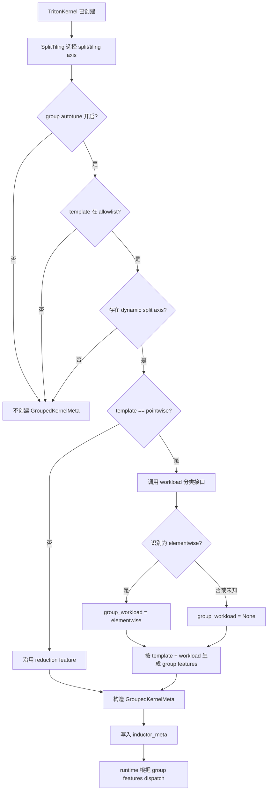

# Symbolic Grouped Autotune 增加 Elementwise Workload 设计

## 1. 文档定位

本文设计在 NPU Inductor 的 grouped symbolic autotune 中，为现有 `pointwise` template
增加 `elementwise` workload 子分类。

本文只讨论分类字段、group feature 分发、元数据传递和兼容边界；elementwise 的具体识别
算法暂不在本阶段确定。

## 2. 背景与问题

当前 Triton kernel 的 heuristic 分类只有三类：

| kernel 状态 | heuristic/template |
| --- | --- |
| persistent reduction | `persistent_reduction` |
| reduction | `reduction` |
| 其他无 reduction kernel | `pointwise` |

NPU codegen 中 `_get_heuristic()` 对无 reduction kernel 直接返回 `pointwise`，没有继续
区分规则的一一映射计算和其他 pointwise 场景。

当前 grouped feature 也只按 template 分发：reduction 使用 outer/reduction 两个 feature，
其他 kernel 使用一个 `pointwise` 总元素数 feature。实现位于：

- `pytorch_new/torch_npu/_inductor/codegen/triton.py`
- `pytorch_new/torch_npu/_inductor/codegen/split_tiling.py`
- `pytorch_new/torch_npu/_inductor/runtime/symbolic_grouping.py`

问题是：即使两个 kernel 都属于 pointwise，它们的最优分组阈值或 benchmark 代表值也可能
不同。需要增加一个细分类入口，但不能把它扩展成新的 Triton heuristic 类型。

## 3. 术语和分类层次

### 3.1 Template 与 workload

`template` 描述 kernel 的整体迭代结构，`workload` 描述 template 内部的工作负载子类：

```text
group_template
├── pointwise
│   ├── group_workload = elementwise
│   └── group_workload = None
├── reduction
└── persistent_reduction
```

其中：

- `pointwise` 仍表示没有 reduction 轴的 Triton kernel template；
- `elementwise` 只表示 pointwise 下的细分类，不是新的 Triton decorator；
- `group_workload=None` 表示暂时未识别或不属于 elementwise 的普通 pointwise；
- reduction 和 persistent reduction 不设置 elementwise workload。

### 3.2 Elementwise 的语义边界

本设计沿用狭义定义：输出元素由输入的对应逻辑位置独立计算得到。

```text
elementwise：out[i] = f(in0[i], in1[i], ...)
pointwise：  out[i] = f(load0(reindex(i)), load1(reindex(i)), ...)
```

因此 broadcast 虽然仍是 pointwise，但不属于本设计中的 elementwise。broadcast 通常不会
在最终 DSL 中表现为独立的 `broadcast` 计算 op，而是在 lowering 阶段通过 `ExpandView`
和 load reindex 表达。

本阶段不确定具体识别实现，分类接口必须允许识别失败并回退到普通 pointwise。

## 4. 目标与非目标

### 4.1 目标

1. 在 `pointwise` 下增加 `group_workload=elementwise` 元数据。
2. 为 elementwise 和普通 pointwise 提供独立的 group feature 分发入口。
3. 只影响开启 grouped symbolic autotune 的动态 shape kernel。
4. 保持现有 Triton heuristic、lowering 和 scheduler 接口不变。
5. 识别不确定时安全回退到普通 pointwise 策略。

### 4.2 非目标

1. 不新增 `elementwise` Triton heuristic 或 decorator。
2. 不修改上游 PyTorch 的 `register_pointwise()`、`make_pointwise()` 或 decomposition。
3. 不在本阶段区分 broadcast、strided、irregular 等其他 pointwise 子类。
4. 不改变静态 shape kernel 的 autotune 行为。
5. 不在本阶段确定 elementwise allowlist 或最终 bucket 阈值。

## 5. 生效条件

elementwise workload 只在以下条件全部满足时产生：

```text
enable_symbolic_shape_group_autotune == true
    ∧ 当前 template 在 symbolic_group_allow_templates 中
    ∧ 当前 kernel 存在 dynamic split axis
    ∧ 当前 template == pointwise
    ∧ elementwise 识别成功
```

当前 grouped 路径已经在没有动态 split axis 时返回 `None`，因此静态 shape 不会创建
grouped meta。该约束应继续保留。

## 6. 总体流程



关键点是：workload 分类发生在 `SplitTiling` 的 grouped 分支内部，而不是 lowering 或
普通 Triton codegen 的通用路径。

## 7. 接口设计

### 7.1 `GroupedKernelMeta`

在现有元数据中增加一个可选字段：

```python
@dataclasses.dataclass(frozen=True, slots=True)
class GroupedKernelMeta:
    enabled: bool
    template: str
    workload: str | None
    primary_group_axis: str | None
    static_split_axes: tuple[str, ...]
    secondary_runtime_symbolic_axes: tuple[str, ...]
    group_features: tuple[GroupFeatureSpec, ...]
    runtime_block_arg_names: tuple[str, ...]
```

建议在 `inductor_meta` 中使用明确字段名：

```python
{
    "group_template": "pointwise",
    "group_workload": "elementwise",
}
```

未识别或旧 payload 使用：

```python
"group_workload": None
```

`to_payload()` 和 `from_payload()` 必须支持缺失字段，以兼容已有 cache/payload。

### 7.2 SplitTiling 内部接口

建议将现有 feature 分发接口从：

```python
_build_group_features(primary_axis)
```

调整为：

```python
_build_group_features(template, workload, primary_axis)
```

workload 识别接口暂定为：

```python
_classify_group_workload() -> str | None
```

本阶段只约定返回值，不固定函数内部实现。返回值只能是：

```text
"elementwise" 或 None
```

任何异常、未知 primitive、来源缺失或无法确认的情况都返回 `None`，不得阻断 kernel
codegen。

## 8. Group Feature 分发

### 8.1 Reduction

保持现有逻辑不变：

```text
reduction/persistent_reduction
├── outer: 非 reduction axis product，bucket=(256,)
└── reduction: reduction axis product，bucket=(8192,)
```

### 8.2 普通 Pointwise

保持现有 feature 和 bucket 不变：

```python
GroupFeatureSpec(
    name="pointwise",
    source="outer_product",
    axis_names=self.all_axis_names(),
    buckets=(num_vector_core * 4096,),
)
```

### 8.3 Elementwise

使用独立的 feature 名称和 bucket 配置：

```python
GroupFeatureSpec(
    name="elementwise_numel",
    source="outer_product",
    axis_names=self.all_axis_names(),
    buckets=ELEMENTWISE_GROUP_BUCKETS,
)
```

`ELEMENTWISE_GROUP_BUCKETS` 的默认值需要通过 profiling 确定。本设计不预先假设它与
pointwise bucket 相同；在阈值尚未确定前，可以暂时复用当前阈值，仅用于打通元数据和
candidate plan 链路。

## 9. Runtime 行为

runtime 不需要新增 elementwise 分支。现有流程已经根据 `group_features` 计算 feature
值、group id、candidate 和 launch policy：

```text
group_workload 只用于：
    - codegen 阶段选择 feature
    - metadata/debug 标识
    - cache/payload 区分

runtime 实际依赖：
    - group_features
    - group_id
    - runtime block policy
```

因此 elementwise 不会引入新的 launcher 参数、grid 表达式或 runtime dispatch 算法。

## 10. 配置与兼容性

### 10.1 配置

现有配置保持不变：

```text
INDUCTOR_ASCEND_SYMBOLIC_GROUP_AUTOTUNE=1
INDUCTOR_ASCEND_SYMBOLIC_GROUP_TEMPLATES=pointwise,reduction,persistent_reduction
```

不增加 `elementwise` template，因为 elementwise 仍属于 pointwise template。

### 10.2 行为兼容

| 场景 | 预期行为 |
| --- | --- |
| group 关闭 | 不执行 workload 分类，行为与当前完全一致 |
| 静态 shape | 不创建 grouped meta，行为与当前完全一致 |
| 动态 reduction | 沿用 reduction/persistent reduction feature |
| 动态普通 pointwise | `group_workload=None`，沿用当前 pointwise feature |
| 动态 elementwise | `group_workload=elementwise`，使用 elementwise feature |
| 无法识别 | 回退 `group_workload=None` |
| 旧 payload | 缺失 workload 时按 `None` 处理 |

## 11. 代码影响范围

预计只修改 NPU grouped symbolic autotune 相关路径：

| 文件 | 修改内容 |
| --- | --- |
| `torch_npu/_inductor/codegen/split_tiling.py` | workload 分类入口、feature 分发参数 |
| `torch_npu/_inductor/runtime/symbolic_grouping.py` | `GroupedKernelMeta` 字段和 payload 兼容 |
| `torch_npu/_inductor/codegen/triton.py` | 将 workload 写入 `inductor_meta` |
| grouped autotune 测试 | 验证 workload、feature 和回退行为 |

明确不修改：

- 上游 `torch/_inductor/lowering.py`；
- `register_pointwise()` 和 `make_pointwise()`；
- decomposition 流程；
- Scheduler 的 pointwise/reduction 分类；
- Triton heuristic 名称和 launcher 接口。

## 12. 验证方案

### 12.1 元数据验证

| 用例 | 检查项 |
| --- | --- |
| group off + dynamic pointwise | `group_enabled=False`，无 workload 分类副作用 |
| group on + static pointwise | 不生成 grouped meta |
| group on + dynamic elementwise | `group_template=pointwise`、`group_workload=elementwise` |
| group on + dynamic ordinary pointwise | `group_workload=None` |
| group on + dynamic reduction | workload 为空，reduction features 不变 |

### 12.2 Runtime 验证

1. elementwise group feature 能生成 reachable group；
2. group id 能根据运行期 numel 正确计算；
3. candidate plan 能复用现有 variant/policy 流程；
4. workload 分类失败时仍能走普通 pointwise grouped plan；
5. 关闭 grouped autotune 时生成代码和运行路径不变化。

### 12.3 性能验证

在实际 NPU 环境中对比：

```text
dynamic elementwise + old pointwise buckets
dynamic elementwise + elementwise buckets
dynamic ordinary pointwise + old pointwise buckets
```

重点观察：

- group 命中率；
- autotune candidate 数量和编译耗时；
- 小/中/大 shape 的 kernel latency；
- workload 误分类时的性能回退幅度。

## 13. 风险与回退

| 风险 | 处理方式 |
| --- | --- |
| elementwise 识别不准确 | 识别失败返回 `None`，沿用普通 pointwise |
| 新增 group 导致 autotune 时间增加 | 限制 feature 数量和 bucket 数，先只增加一个 feature |
| 新旧 payload 不兼容 | `from_payload()` 对缺失 workload 使用 `None` |
| elementwise bucket 不合理 | 保留独立 bucket 配置，后续通过 profiling 调整 |
| workload 误进入 reduction | 只在 `template == pointwise` 时调用分类接口 |
| group 未开启时引入额外开销 | 在 `apply_grouped_rewrite_if_needed()` 的开关判断之后执行 |

## 14. 待确认问题

1. elementwise 的最终识别依据采用 lowering primitive allowlist、IR 属性还是二者组合；
2. broadcast 是否一律排除，还是允许某些静态 size-one 场景归入 elementwise；
3. elementwise 默认 bucket 是否需要独立于 pointwise；
4. `group_workload` 是否需要加入现有 autotune cache key；
5. 是否需要增加独立环境变量控制 elementwise workload 灰度发布。

